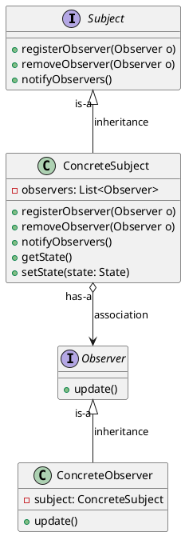

### Observer Pattern Notes

#### 1. Definition
The Observer Pattern defines a one-to-many dependency between objects so that when one object changes state, all of its dependents are notified and updated automatically.

#### 2. Key Concepts
- **One subject - many observers**
- **Loose coupling between objects**

#### 3. Class Diagram

#### 4. Design Principles

##### Strive for Loosely Coupled Designs Between Objects that Interact

##### Loose Coupling Benefits:

- **Interface-Based**: The subject knows only that the observer implements a certain interface (the Observer interface). It doesn’t need to know the concrete class of the observer, what it does, or anything else about it.

- **Dynamic Addition**: New observers can be added at any time. Observers can also be replaced at runtime without affecting the subject.

- **Independent Modification**: The subject doesn't need modifications to accommodate new observer types. Any new class can become an observer by implementing the Observer interface and registering itself with the subject.

- **Reusability**: Subjects and observers can be reused independently in different contexts.

- **Decoupled Changes**: Changes to either the subject or an observer will not affect the other as long as they continue to implement their respective interfaces.

### Below are versions, how our code is optimised/ solving problems:

#### 1. Version-1: (Existing code):

- **Change request/ product requirement:** create an app
  that uses the WeatherData object to update three displays for current conditions, weather stats, and a forecast.

#### 2. Version-2: (Modified existing with minimal changes):

- **Challenges/ problems with this code:**
  1. We are coding to concrete implementations, not interfaces (try to apply design principle: `Program to interface, not implementations`)
  2. For every new display we’ll need to
     alter this code.
  3. We haven’t encapsulated the part that
     changes. (try to apply design principle: `Encapsulate what varies`)
  4. We have no way to add (or remove)
     display elements at runtime.

**Below are the issues in code with version 2:**
