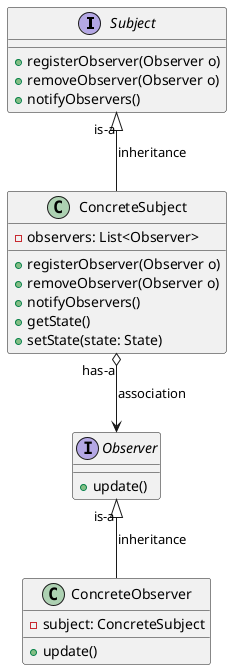
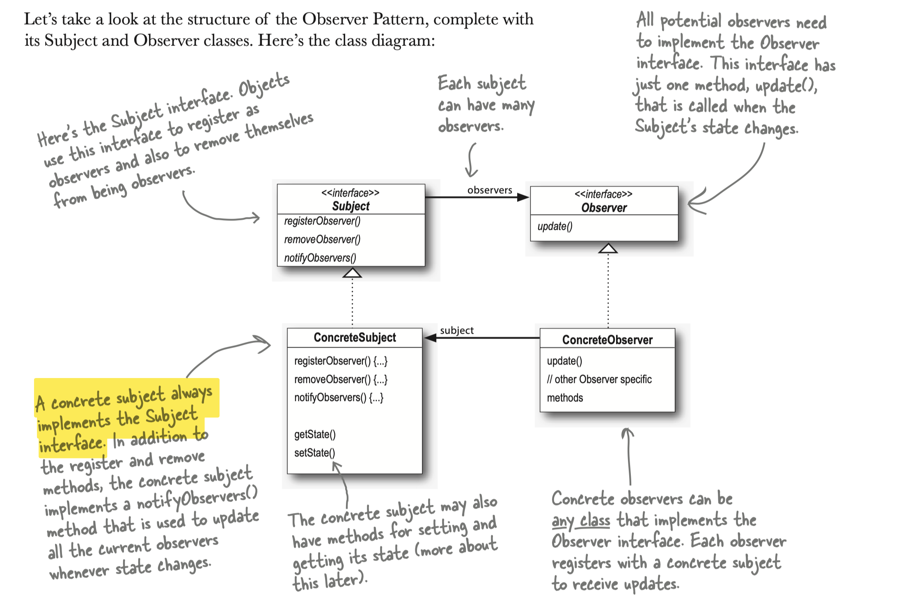
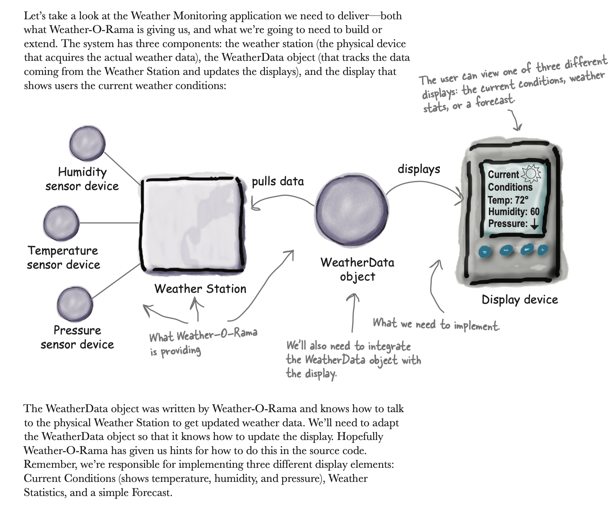
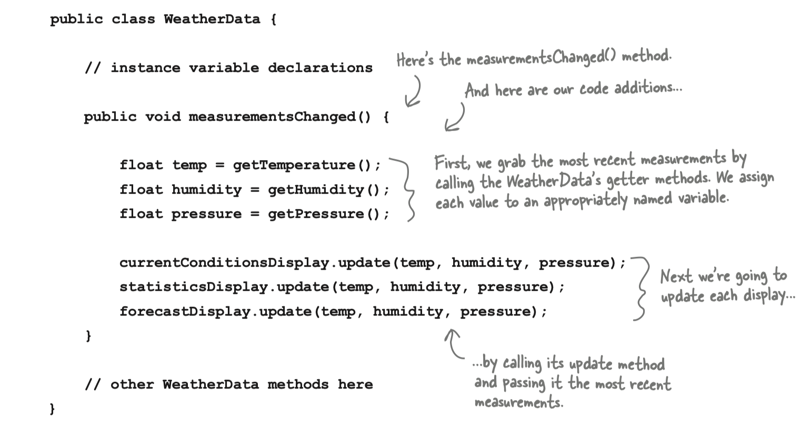
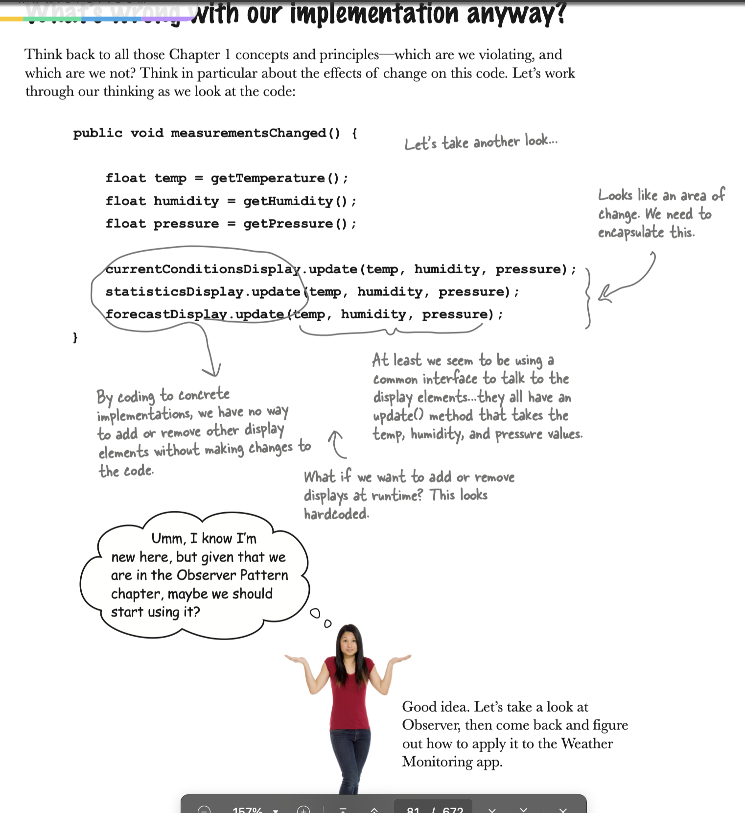
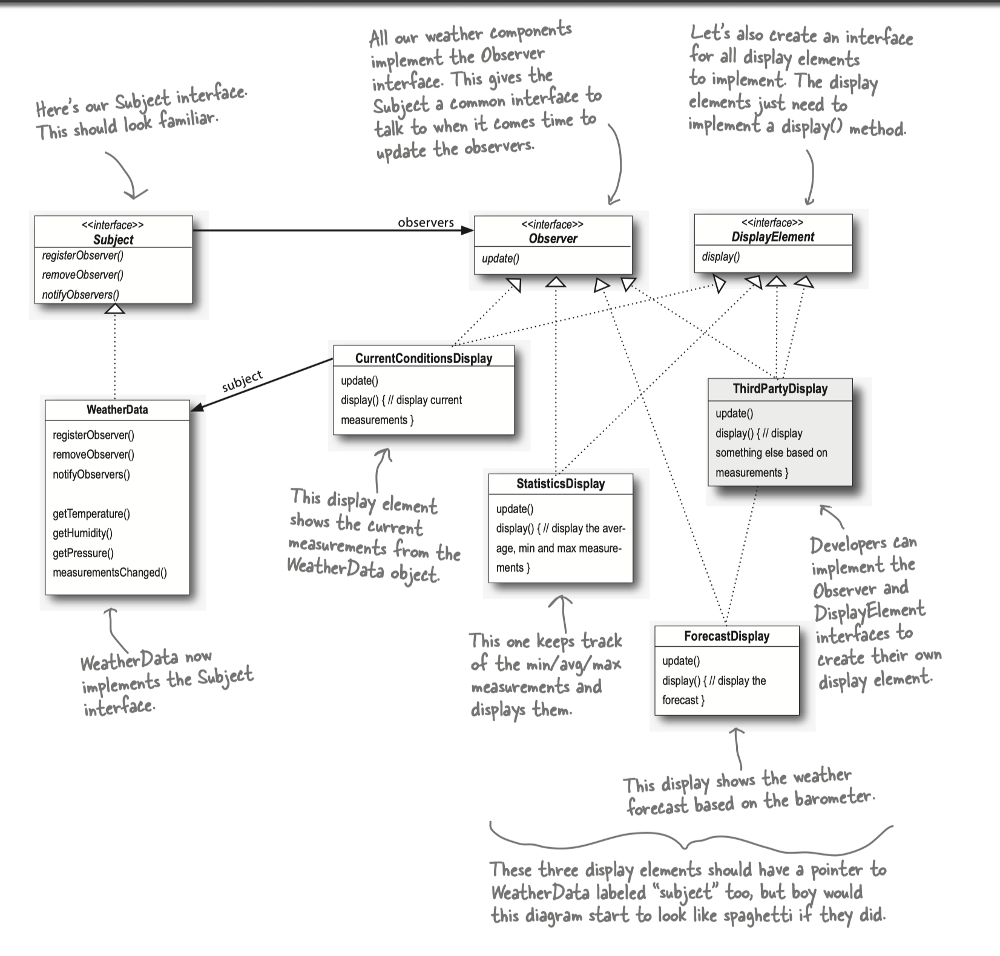
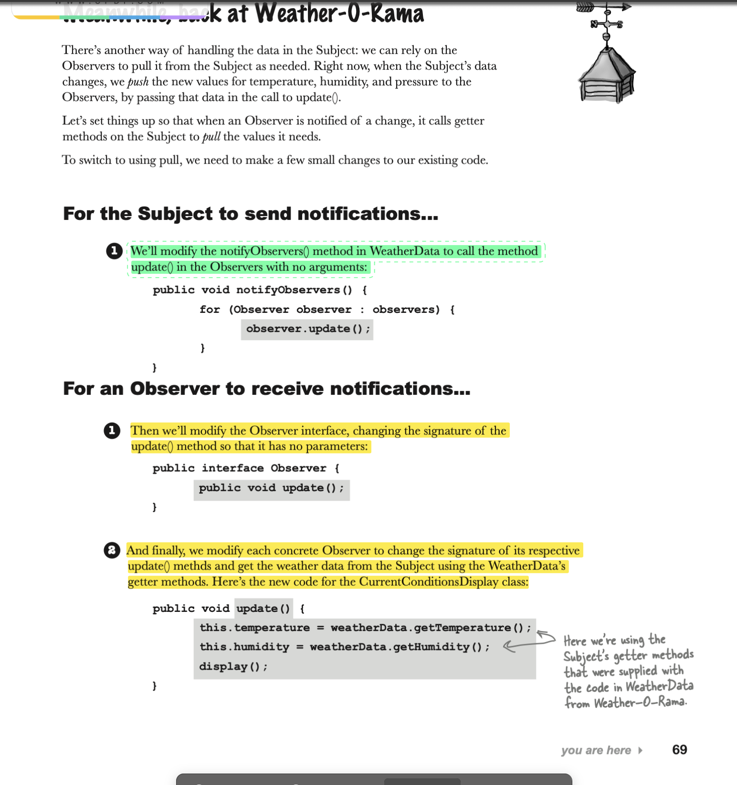
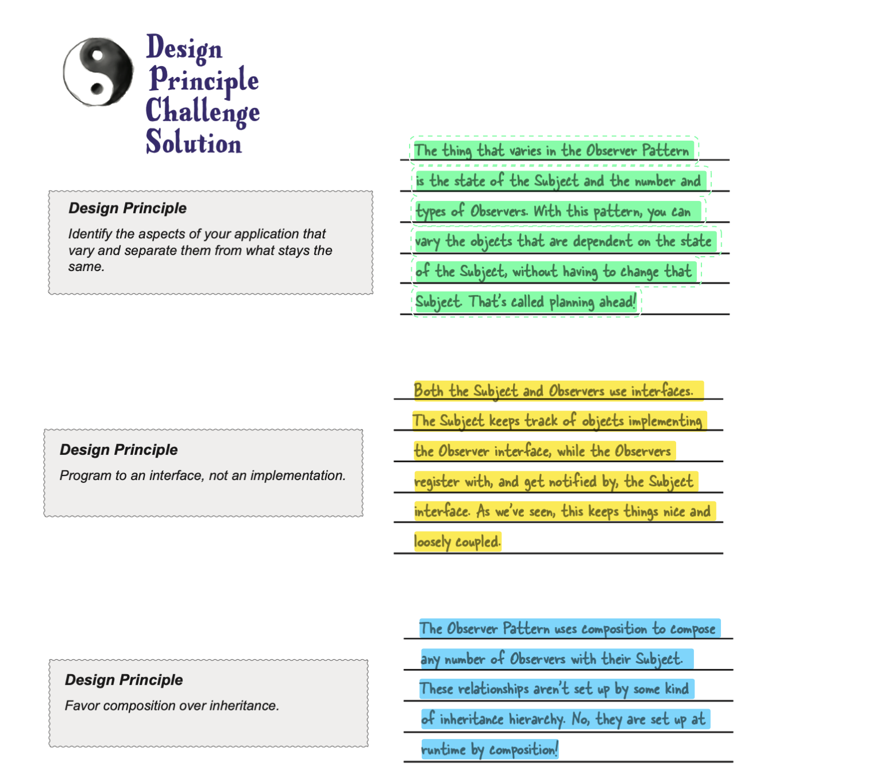

### Observer Pattern Notes

#### 1. Definition
The Observer Pattern defines a one-to-many dependency between objects so that when one object changes state, all of its dependents are notified and updated automatically.

#### 2. Key Concepts
- **One subject - many observers**
- **Loose coupling between objects**

#### 3. Class Diagram



#### 4. Design Principles

##### Strive for Loosely Coupled Designs Between Objects that Interact

##### Loose Coupling Benefits:

- **Interface-Based**: The subject knows only that the observer implements a certain interface (the Observer interface). It doesn’t need to know the concrete class of the observer, what it does, or anything else about it.

- **Dynamic Addition**: New observers can be added at any time. Observers can also be replaced at runtime without affecting the subject.

- **Independent Modification**: The subject doesn't need modifications to accommodate new observer types. Any new class can become an observer by implementing the Observer interface and registering itself with the subject.

- **Reusability**: Subjects and observers can be reused independently in different contexts.

- **Decoupled Changes**: Changes to either the subject or an observer will not affect the other as long as they continue to implement their respective interfaces.


### Below are versions, how our code is optimised/ solving problems:

#### 1. Version-1: (Existing code):


- **Change request/ product requirement:** create an app
  that uses the WeatherData object to update three displays for current conditions, weather stats, and a forecast.

#### 2. Version-2: (Modified existing with minimal changes):

- **Challenges/ problems with this code:**
  1. We are coding to concrete implementations, not interfaces (try to apply design principle: `Program to interface, not implementations`)
  2. For every new display we’ll need to
     alter this code.
  3. We haven’t encapsulated the part that
     changes. (try to apply design principle: `Encapsulate what varies`)
  4. We have no way to add (or remove)
     display elements at runtime.

**Below are the issues in code with version 2:**


#### 3. Version-3: (solution-1, push model of observer pattern):


***Code***:
[Link to code for solution 1](push-type-observer-pattern)

- When should we implement this: If we are sure, we are going to send all the available information to observers and 
it is not going to change in future.

**Problems**:
- In our current Weather Station design, we are pushing all three pieces of  data
to the update() method in the displays, even if  the displays don’t need all these values. 
- That’s okay, but what if  Weather-O-Rama adds another data value later, like wind speed? Then we’ll have to change all the update() methods in all the displays, even if  most of  them don’t need or want the wind speed data.
- Now, whether we pull or push the data to the Observer is an implementation
detail, but in a lot of  cases it makes sense to let Observers retrieve the data they need rather than passing more and more data to them through the update() method. After all, over time, this is an area that may change and grow unwieldy.

#### 4. Version-4: (solution-2, pull model of observer pattern):


***Code***:
[Link to code for solution 2](pull-type-observer-pattern)

***Changes***:

1. Change in parameters:
   - push type:
    ```
    public interface Observer {
        void update(float temp, float humidity, float pressure);
    }
    ```
    - pull type: (update)
    ```
    public interface Observer {
        void update(); // changed this for pull type
    }
    ```
2. Update implementations of observer:
   - push type:
   ```
   @Override
    public void update(float temperature, float humidity, float pressure) {
        this.temperature = temperature;
        this.humidity = humidity;
        display();
    }
   ```
   - pull type: (update)
   ```
   @Override
    public void update() { // changed this for pull type, fetching only required data
        this.temperature = ((WeatherData) weatherData).getTemperature();
        this.humidity = ((WeatherData) weatherData).getHumidity();
        display();
    }
   ```


### Key Notes:

